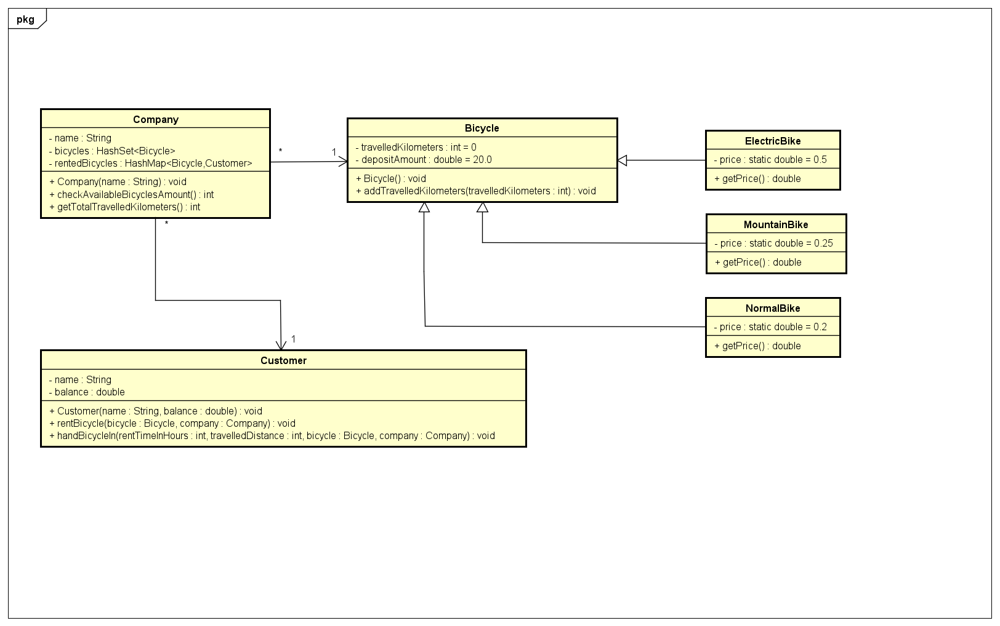

# Startdocument for Bike Rental

## Startdocument of Chris Klunder. Student number 5051053.

# Problem Description 
De NS Groep wil software voor het bijhouden van het fietsverhuur. De software
moet bijhouden hoeveel fietsen er nog beschikbaar zijn voor verhuur. Er zijn
drie verschillende fietsen: een normale fiets, een mountainbike en een e-bike.
Een klant kan een fiets voor een bepaalde tijd huren. De eindtijd wordt
geregistreerd als de klant de fiets terug brengt. In elke fiets zit een GPS-tracker.
Deze trackt de afstand die de klant aflegt met de fiets. Bij aanvang van huren
betaald de klant €20,- borg. De klant betaalt per kilometer. Dit is:

* €0,20 voor een normale fiets;
* €0,25 voor een mountainbike;
* €0,50 voor een e-bike.
Per uur betaald de klant €2,-. Als de klant de fiets terug brengt moet hij
betalen. Voor onderhoudswerkzaamheden wil de NS Groep de totale afgelegde
afstand per fiets weten.

# Input & Output
In this section the in- and output of the application will be described.

## Input
In the table below all the input (that the user has to input in order to make the application work) are described.
<table>
    <thead>
        <tr>
            <th>Case</th>
            <th>Type</th>
            <th>Conditions</th>
        </tr>
    <thead>
    <tbody>
        <tr>
            <td>Company</td>
            <td>Customer</td>
            <td>Not empty or null</td>
        </tr>
        <tr>
            <td>Bicycle</td>
            <td>Bicycle</td>
            <td>Not empty or null</td>
        </tr>
         <tr>
            <td>Customer</td>
            <td>Customer</td>
            <td>Not empty or null</td>
        </tr>
    </tbody>
<table>

## Output

<table>
    <thead>
        <tr>
            <th>Case</th>
            <th>Type</th>
        </tr>
    <thead>
    <tbody>
        <tr> 
            <td>Total travelled kilometers of a bicycle</td>
            <td>integer</td>
        </tr>
         <tr> 
            <td>Deposit amount of a bicycle</td>
            <td>double</td>
        </tr>
         <tr> 
            <td>Price of renting a bicycle per kilometer</td>
            <td>double</td>
        </tr>
          <tr> 
            <td>Amount of currently available bicycles for renting</td>
            <td>integer</td>
        </tr>
         <tr> 
            <td>Get the total amount of travelled kilometers of all bicycles of a company</td>
            <td>integer</td>
        </tr>
    </tbody>
<table>

## Calculations

<table>
    <thead>
        <tr>
            <th>Case</th>
            <th>Calculation</th>
        </tr>
    <thead>
    <tbody>
        <tr>
            <td>Total travelled kilometer amount of all bicycles of a company</td>
            <td>Add all of the travelled kilometer amounts of the bicycles of a company to eachother</td>
        </tr>
        <tr>
            <td>The amount of currently available bicycles</td>
            <td>Loop through the list of bicycles, compare to list of rented bicycles, add 1 for each bicycle that isn't currently rented</td>
        </tr>
       <tr>
            <td>The price a customer has to pay when handing in a bicycle after renting it</td>
            <td>Price equals (kilometer price of the bicycle * the travelled distance in kilometers) + (the rented time in hours * 2) - the deposit amount that has been paid when renting the bicycle</td>
        </tr>
    </tbody>
<table>

## Remarks
<ul>
    <li>Input will be validated.</li>
    <li>Unit Tests will be provided.</li>
</ul>

# Class Diagram

# Testplan
In this section the testcases will be described to test the application.

# Test Data

In the following table you'll find all the data that is needed for testing.

## Company

<table>
    <thead>
        <tr>
            <th>ID</th>
            <th>Input</th>
            <th>Code</th>
        </tr>
    <thead>
    <tbody>
         <tr> 
            <td><code>Erazer</code></td>
            <td>name: <code>Erazer</code></td>
            <td><code>new Company("Erazer")</code></td>
        </tr>
    </tbody>
</table>

## Bicycle

<table>
    <thead>
        <tr>
            <th>ID</th>
            <th>Input</th>
            <th>Code</th>
        </tr>
    <thead>
    <tbody>
        <tr> 
            <td><code>ElectricBike</code></td>
            <td>-</td>
            <td><code>new ElectricBike()</code></td>
        </tr>
        <tr> 
            <td><code>MountainBike</code></td>
            <td>-</td>
            <td><code>new MountainBike()</code></td>
        </tr>
        <tr> 
            <td><code>NormalBike</code></td>
            <td>-</td>
            <td><code>new NormalBike()</code></td>
        </tr>
    </tbody>
</table>

## Customer

<table>
    <thead>
        <tr>
            <th>ID</th>
            <th>Input</th>
            <th>Code</th>
        </tr>
    <thead>
    <tbody>
        <tr> 
            <td><code>Peter</code></td>
            <td>name: <code>Peter</code> balance: <code>75.69</code></td>
            <td><code>new Customer("Peter", 75.69);</code></td>
        </tr>
        <tr> 
            <td><code>Pedro</code></td>
            <td>name: <code>Pedro</code> balance: <code>100.00</code></td>
            <td><code>new Customer("Pedro", 100.00);</code></td>
        </tr>
        <tr> 
            <td><code>Anton</code></td>
            <td>name: <code>Anton</code> balance: <code>70.54</code></td>
            <td><code>new Customer("Anton", 70.54);</code></td>
        </tr>
         <tr> 
            <td><code>Andrea</code></td>
            <td>name: <code>Andrea</code> balance: <code>80.12</code></td>
            <td><code>new Customer("Andrea", 80.12);</code></td>
        </tr>
    </tbody>
</table>

# Test Cases
In this section the testcases will be described. Every test case should be executed with the test data as starting point.

#### Note: bicycles have been added to the company in the code before executing these tests

## 1. getTravelledKilometers

<table>
    <thead>
        <tr>
            <th>Step</th>
            <th>Input</th>
            <th>Action</th>
            <th>Expected output</th>
        </tr>
    <thead>
    <tbody>
        <tr> 
            <td>1</td>
            <td><code>ElectricBike</code></td>
            <td><code>getTravelledKilometers()</code></td>
            <td><code>0</code></td>
        </tr>
        <tr> 
            <td>2</td>
            <td><code>ElectricBike</code></td>
            <td><code>addTravelledKilometers(104)</code></td>
            <td><code>-</code></td>
        </tr>
        <tr> 
            <td>3</td>
            <td><code>ElectricBike</code></td>
            <td><code>getTravelledKilometers()</code></td>
            <td><code>104</code></td>
        </tr>
        <tr> 
            <td>4</td>
            <td><code>ElectricBike</code></td>
            <td><code>addTravelledKilometers(52)</code></td>
            <td><code>-</code></td>
        </tr>
        <tr> 
            <td>5</td>
             <td><code>ElectricBike</code></td>
            <td><code>getTravelledKilometers()</code></td>
            <td><code>156</code></td>
        </tr>
          <tr> 
            <td>6</td>
            <td><code>ElectricBike</code></td>
            <td><code>addTravelledKilometers(200)</code></td>
            <td><code>-</code></td>
        </tr>
         <tr> 
            <td>7</td>
             <td><code>ElectricBike</code></td>
            <td><code>getTravelledKilometers()</code></td>
            <td><code>356</code></td>
        </tr>
    </tbody>
<table>

## 2. getTotalTravelledKilometers
<table>
    <thead>
        <tr>
            <th>Step</th>
            <th>Input</th>
            <th>Action</th>
            <th>Expected output</th>
        </tr>
    <thead>
    <tbody>
        <tr> 
            <td>1</td>
            <td><code>ElectricBike</code></td>
            <td><code>addTravelledKilometers(20)</code></td>
            <td><code>-</code></td>
        </tr>
        <tr> 
            <td>2</td>
            <td><code>Company</code></td>
            <td><code>getTotalTravelledKilometers()</code></td>
            <td><code>20</code></td>
        </tr>
        <tr> 
            <td>3</td>
            <td><code>MountainBike</code></td>
            <td><code>addTravelledKilometers(5)</code></td>
            <td><code>-</code></td>
        </tr>
        <tr> 
            <td>4</td>
             <td><code>Company</code></td>
            <td><code>getTotalTravelledKilometers()</code></td>
            <td><code>25</code></td>
        </tr>
    </tbody>
<table>

## 3. checkAvailableBicyclesAmount
<table>
    <thead>
        <tr>
            <th>Step</th>
            <th>Input</th>
            <th>Action</th>
            <th>Expected output</th>
        </tr>
    <thead>
    <tbody>
        <tr> 
            <td>1</td>
            <td><code>Company</code></td>
            <td><code>checkAvailableBicyclesAmount()</code></td>
            <td><code>0</code></td>
        </tr>
        <tr> 
            <td>2</td>
            <td><code>Company</code></td>
            <td><code>addBicycle(mountainBike)</code></td>
            <td><code>-</code></td>
        </tr>
        <tr> 
            <td>3</td>
            <td><code>Company</code></td>
            <td><code>checkAvailableBicyclesAmount()</code></td>
            <td><code>1</code></td>
        </tr>
        <tr> 
            <td>4</td>
            <td><code>Company</code></td>
            <td><code>addBicycle(electricBike)</code></td>
            <td><code>-</code></td>
        </tr>
        <tr> 
            <td>5</td>
            <td><code>Company</code></td>
            <td><code>checkAvailableBicyclesAmount()</code></td>
            <td><code>2</code></td>
        </tr>
        <tr> 
            <td>6</td>
            <td><code>Company</code></td>
            <td><code>addBicycle(normalBike)</code></td>
            <td><code>-</code></td>
        </tr>
        <tr> 
            <td>7</td>
            <td><code>Company</code></td>
            <td><code>checkAvailableBicyclesAmount()</code></td>
            <td><code>3</code></td>
        </tr>
        <tr> 
            <td>8</td>
             <td><code>Company</code></td>
            <td><code>removeBicycle(normalBike)</code></td>
            <td><code>-</code></td>
        </tr>
        <tr> 
            <td>9</td>
            <td><code>Company</code></td>
            <td><code>checkAvailableBicyclesAmount()</code></td>
            <td><code>2</code></td>
        </tr>
        <tr> 
            <td>10</td>
            <td><code>Company</code></td>
            <td><code>rentBicycle(electricBike, company)</code></td>
            <td><code>-</code></td>
        </tr>
         <tr> 
            <td>11</td>
            <td><code>Company</code></td>
            <td><code>checkAvailableBicyclesAmount()</code></td>
            <td><code>1</code></td>
        </tr>
    </tbody>
<table>

## 4. rentBicycle
<table>
    <thead>
        <tr>
            <th>Step</th>
            <th>Input</th>
            <th>Action</th>
            <th>Expected output</th>
        </tr>
    <thead>
    <tbody>
        <tr> 
            <td>1</td>
            <td><code>MountainBike, Company</code></td>
            <td><code>rentBicycle(mountainBike, company)</code></td>
            <td><code>-</code></td>
        </tr>
         <tr> 
            <td>2</td>
            <td><code>MountainBike</code></td>
            <td><code>getBicycles.contains(mountainBike)</code></td>
            <td><code>true</code></td>
        </tr>
        <tr> 
            <td>3</td>
            <td><code>ElectricBike, Company</code></td>
            <td><code>rentBicycle(electricBike, company)</code></td>
            <td><code>-</code></td>
        </tr>
        <tr> 
            <td>4</td>
            <td><code>Customer</code></td>
            <td><code>getRentedBicycles.containsValue(anton)</code></td>
            <td><code>true</code></td>
        </tr>
        <tr> 
            <td>5</td>
            <td><code>Customer</code></td>
            <td><code>getBalance()</code></td>
            <td><code>50.54</code></td>
        </tr>
    </tbody>
<table>

## 5. handBicycleIn
<table>
    <thead>
        <tr>
            <th>Step</th>
            <th>Input</th>
            <th>Action</th>
            <th>Expected output</th>
        </tr>
    <thead>
    <tbody>
        <tr> 
            <td>1</td>
            <td><code>ElectricBike, Company</code></td>
            <td><code>rentBicycle(electricBike, company)</code></td>
            <td><code>-</code></td>
        </tr>
        <tr> 
            <td>2</td>
            <td><code>ElectricBike, Company</code></td>
            <td><code>getRentedBicycles().containsValue(anton)</code></td>
            <td><code>true</code></td>
        </tr>
        <tr> 
            <td>3</td>
            <td><code>ElectricBike, Company</code></td>
            <td><code>handBicycleIn(2, 25, electricBike, company)</code></td>
            <td><code>-</code></td>
        </tr>
        <tr> 
            <td>4</td>
            <td><code>anton</code></td>
            <td><code>getBalance()</code></td>
            <td><code>54.04</code></td>
        </tr>
        <tr> 
            <td>5</td>
            <td><code>electricBike</code></td>
            <td><code>getRentedBicycles().containsKey(electricBike)</code></td>
            <td><code>false</code></td>
        </tr>
        <tr> 
            <td>6</td>
            <td><code>anton</code></td>
            <td><code>getRentedBicycles().containsValue(anton)</code></td>
            <td><code>false</code></td>
        </tr>
    </tbody>
<table>

